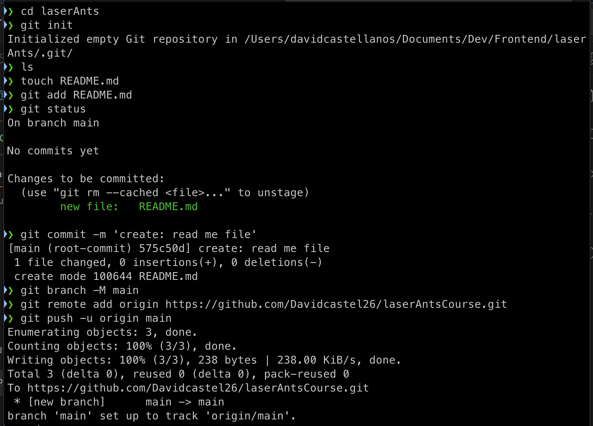
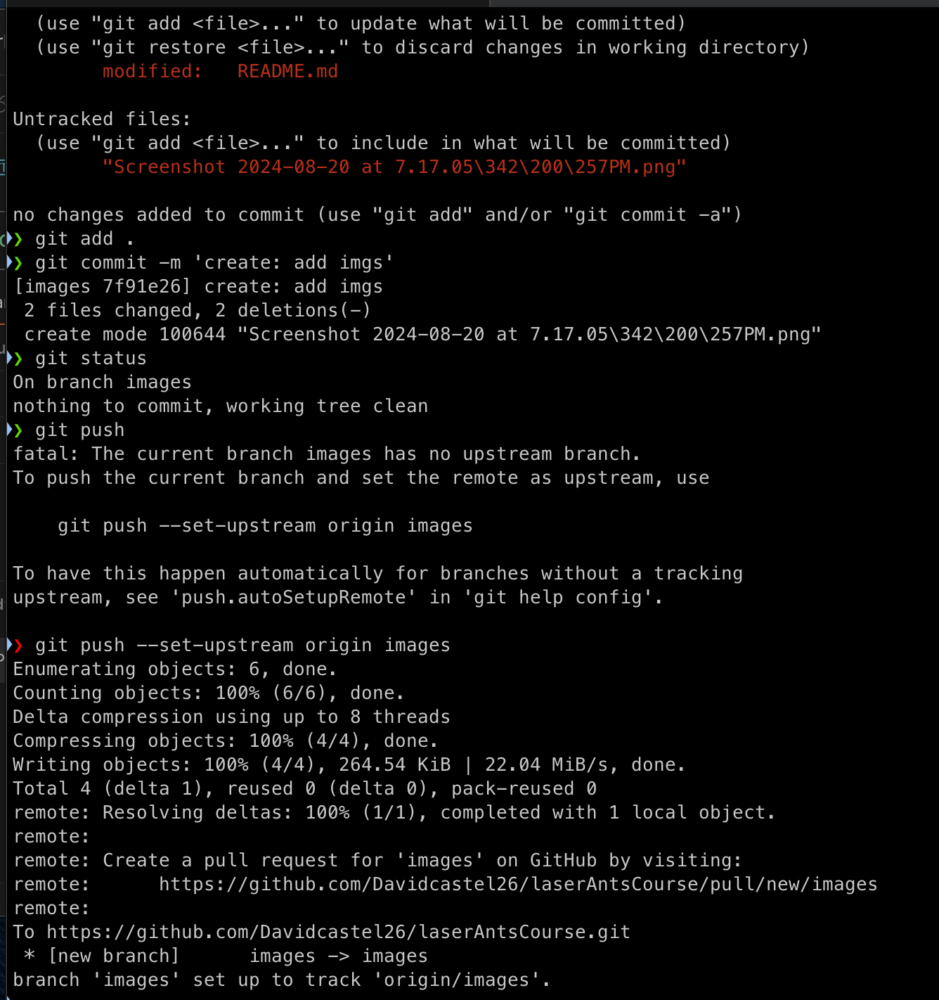
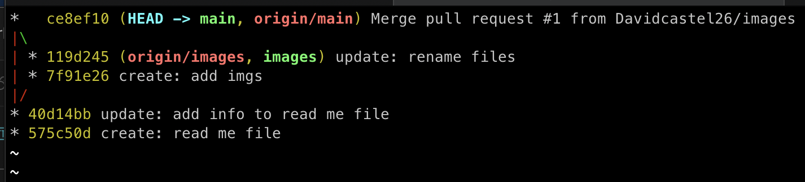

## we create the repository with this commands

```
echo "# laserAntsCourse" >> README.md
git init
git add README.md
git commit -m "first commit"
git branch -M main
git remote add origin https://github.com/Davidcastel26/laserAntsCourse.git
git push -u origin main
```

this is the first step



then we create a branch and upload it into the repo



This is how we come with the two branches

